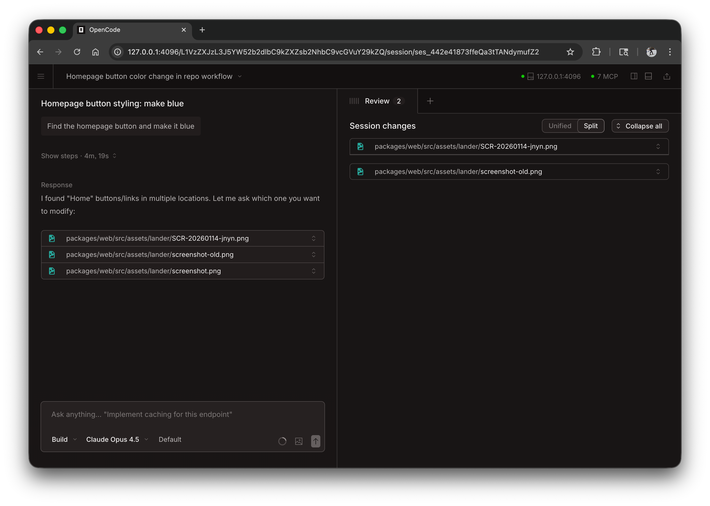

Creatine はブラウザで Web アプリケーションとして実行でき、ターミナルを必要とせずに同じ強力な AI コーディングエクスペリエンスを提供します。


---

## はじめる

以下を実行して Web インターフェースを開始します。

```bash
creatine web
```

これにより、利用可能なランダムなポートを使用して `127.0.0.1` でローカルサーバーが起動され、デフォルトのブラウザで Creatine が自動的に開きます。

:::caution
`CREATINE_SERVER_PASSWORD` が設定されていない場合、サーバーは保護されません。これはローカルで使用する場合には問題ありませんが、ネットワークアクセス用に設定する必要があります。
:::
:::tip[Windows ユーザー]
最高のエクスペリエンスを得るには、PowerShell ではなく [WSL](/docs/windows-wsl) から `creatine web` を実行します。これにより、ファイルシステムへの適切なアクセスとターミナルの統合が保証されます。
:::

---

## 設定

コマンドラインフラグを使用するか、[設定ファイル](/docs/config)で Web サーバーを設定できます。

### ポート

デフォルトでは、Creatine は使用可能なポートを選択します。ポートを指定できます。

```bash
creatine web --port 4096
```

### ホスト名

デフォルトでは、サーバーは `127.0.0.1` (localhost のみ) にバインドされます。ネットワーク上で Creatine にアクセスできるようにするには:

```bash
creatine web --hostname 0.0.0.0
```

`0.0.0.0` を使用すると、Creatine はローカルアドレスとネットワークアドレスの両方を表示します。

```
  Local access:       http://localhost:4096
  Network access:     http://192.168.1.100:4096
```

### mDNS 検出

mDNS を有効にして、ローカルネットワーク上でサーバーを検出できるようにします。

```bash
creatine web --mdns
```

これにより、ホスト名が自動的に `0.0.0.0` に設定され、サーバーが `opencode.local` としてアドバタイズされます。

mDNS ドメイン名をカスタマイズして、同じネットワーク上で複数のインスタンスを実行できます。

```bash
creatine web --mdns --mdns-domain myproject.local
```

### CORS

CORS の追加ドメインを許可するには (カスタムフロントエンドに便利):

```bash
creatine web --cors https://example.com
```

### 認証

アクセスを保護するには、`CREATINE_SERVER_PASSWORD` 環境変数を使用してパスワードを設定します。

```bash
CREATINE_SERVER_PASSWORD=secret creatine web
```

ユーザー名のデフォルトは `creatine` ですが、`CREATINE_SERVER_USERNAME` で変更できます。

---

## Web インターフェースの使用

開始すると、Web インターフェイスから Creatine セッションにアクセスできるようになります。

### セッション

ホームページからセッションを表示および管理します。アクティブなセッションを確認したり、新しいセッションを開始したりできます。



### サーバーステータス

「サーバーを表示」をクリックすると、接続されているサーバーとそのステータスが表示されます。


---

## ターミナルの接続

実行中の Web サーバーにターミナル TUI を接続できます。

```bash
# Start the web server
creatine web --port 4096

# In another terminal, attach the TUI
creatine attach http://localhost:4096
```

これにより、Web インターフェイスとターミナルの両方を同時に使用し、同じセッションと状態を共有できるようになります。

---

## 設定ファイル

`opencode.json` 設定ファイルでサーバー設定を構成することもできます。

```json
{
  "server": {
    "port": 4096,
    "hostname": "0.0.0.0",
    "mdns": true,
    "cors": ["https://example.com"]
  }
}
```

コマンドラインフラグは、設定ファイルの設定よりも優先されます。
